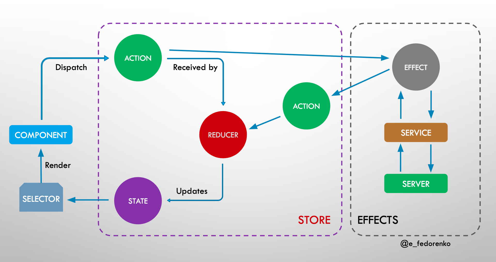

# Ngrx Common Concept (without entity, Part I)



- [Установка Angular CLI](#install-angular-cli)
- [Запуск Development Backend Server](#run-backend-server)
- [Запуск UI Server](#run-ui-server)
- [Добавляем ngRx](#add-ngrx)
- [Добавляем `feature`](#add-feature)
- [Обновляем `state store`](#update-state-store)
- [`Action`](#action)
- [`Reducer`](#reducer)
- [Как прочитать данные из `store` (напрямую из store)](#how-read-data-from-store)
- [`Selector` - _оптимальный_ вариант получения данных из `store`](#selector)
- [Получаем state конкретной `feature`](#get-state-feature-through-selectors)
- [Effects](#effects)
- [Dev Tools for NgRx](#dev-tools-for-ngrx)

## Install Angular CLI

При помощи команды ниже angular-cli будет установлена глобально на вашей машине:
`npm install -g @angular/cli `

## Run Backend Server

Мы можем запустить backend приложение при помощи следующей команды:

`npm run server`

Это небольшой написанный на Node REST API сервер.

## Run UI Server

Чтобы запустить frontend часть нашего кода, мы будем использовать Angular CLI:

`npm start `

Приложение доступно на порту 4200: [http://localhost:4200](http://localhost:4200)

## Add ngRx

- `ng add @ngrx/store@latest`
- `ng add @ngrx/store-devtools@latest`


- Обновится `app.module.ts`
- Можем использовать _Redux DevTools Extension_ в браузере

## Add `feature`

Добавим `store` в `Auth.module`:

`ng g store auth/Auth --module auth.module.ts`

- Тем самым мы создадим: `ngrx-course\src\app\auth\reducers\index.ts`
- зарегистрируем в `Auth.module` reducer: 
```
StoreModule.forFeature(fromAuth.authFeatureKey, authReducer),
```

## Update `state store`

Чтобы обновить `state store`: 
- мы в компоненте inject-им `store` (`Observable`) 
- вызываем на нем `dispatch` метод пробрасывая в него соотв-й `action`:

```
this.store.dispatch(login({user}));
```
(`login.component.ts`)


## `Action`
В квадратных скобках указываем место, откуда срабатывает `action`, далее идет описание `action`

```
export const login = createAction(
    '[Login Page] User Login',
    props<{user: User}>()
)
```

## `Reducer`

Создадим reducer `authReducer`, который будет обрабатывать наши `action` и обновлять `state`, 
зарегистрируем его в `Auth.module`:
```
StoreModule.forFeature(fromAuth.authFeatureKey, authReducer),
```

## How read data from `store`

Инжектим в конструкторе:
```ts
(private store: Store<AppState>)
```

`store` - это `Observable`, на который мы можем подписаться, чтобы получать актуальный `state`:

```ts
this.store.subscribe((state) => {
    console.log('state:', state)
});
this.isLoggedIn$ = this.store.pipe(map((state) => !!state['auth'].user));
this.isLoggedOut$ = this.store.pipe(map((state) => !state['auth'].user));
```
(`app.component.ts`)

## Selector

Selectors позволяют получать значение лишь после того, как оно изменило свое значение
т.е. сохранять предыдущее значение в памяти (в отличие от подписки выше)

```ts
// src/app/auth/selectors/auth.selectors.ts
export const isLoggedIn = createSelector(
    state => state['auth'],
    (auth) => !!auth.user
);

// app.component.ts
export const isLoggedOut = createSelector(
    isLoggedIn, // используем isLoggedIn селектор, чтобы сразу получить нужное значение и преобразовать его
    loggedIn => !loggedIn
);
```

Функции в `createSelector` похожи на обычную `map` ф-ю, но сохраняет значение в памяти. \
Используем селектор:

```
this.isLoggedIn$ = this.store.pipe(select(isLoggedIn));
this.isLoggedOut$ = this.store.pipe(select(isLoggedOut));
```

## get state feature through selectors

Получаем state конкретной `feature`:

```ts
export const selectAuthState = createFeatureSelector<AuthState>('auth'); // берем нашу feature
export const isLoggedIn = createSelector(
    selectAuthState,
    (auth) => !!auth.user
);
```

## Effects

Эффекты позволяют реализовать side-effect, например, если `action` вызывает запрос к б.д.
или сохранение данных в `localstorage`

В `app.module.ts` добавим `EffectsModule.forRoot`:


```ts
imports: [
    EffectsModule.forRoot([])
]
```

в `auth.module` добавим для `EffectsModule.forFeature`:

```ts
imports: [
    EffectsModule.forFeature([AuthEffect])
]
```

```ts
login$ = createEffect(() => {
    return this.actions$.pipe(
        ofType(login),
        tap(action => {
            localStorage.setItem('user', JSON.stringify(action.user));
        })
    )
},
{dispatch: false}) // этот эффект не диспатчит побочные action, превентим infinite loop
```
(`src/app/auth/effects/auth.effect.ts`)


## Dev Tools for NgRx

### Router Store and the Time-Travelling Debugger

Зарегистрируем reducer на роутинг (actions, router info -  state etc): \
В основном модуле добавим `StoreRouterConnectingModule` (`app.module.ts`):

```ts
StoreRouterConnectingModule.forRoot({
    stateKey: 'router',
    routerState: RouterState.Minimal
})
```
Также зарегистрируем reducer router в основном reducer:

```
export const reducers: ActionReducerMap<AppState> = {
    router: routerReducer
};
```

### Run time check
- Проверяем, что `state` в `reducer` иммутабельный (т.е. проверяем, что `state` в reducer меняется корректно). *1
- Проверяем, что `actions` иммутабельный *2
- Проверяем, что actions Serializability *3 (обьект распарсится в строку)
- Проверяем, что  state Serializability *4

Добавляем в `StoreModule`:

```ts
StoreModule.forRoot(reducers, {
    runtimeChecks: {
        strictStateImmutability: true,
        strictActionImmutability: true,
        strictActionSerializability: true,
        strictStateSerializability: true
    }
}),
```

###  metareducer

`metareducer` - это reducer, который вызывается до выполнения стандартного reducer. \
см. `logger`
